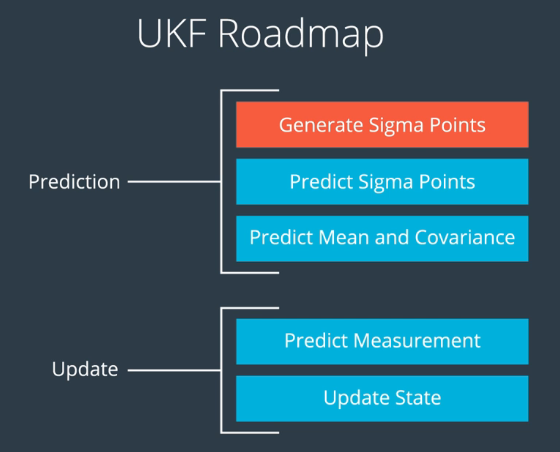

## 简介
基于UKF的后融合目标追踪，输入为带有噪声的Lidar和Radar的目标检测结果，输出为融合后的目标坐标


UKF的算法实现在`src/ukf.cpp`和`src/ukf.h`两个文件中。下图是UKF的大致步骤

  

如下图所示，绿色为自车，蓝色为被追踪的目标车辆，红色小球表示Lidar目标检测的结果，粉色线段表示Radar检测的结果，绿色小球表示融合后的目标车辆位置，绿色箭头表示融合后的目标车辆速度。

  

---

## 依赖
* cmake >= 3.0
* PCL >= 1.2

## 如何运行
```bash
mkdir build
cd build
cmake ..
make
./ukf_highway
```